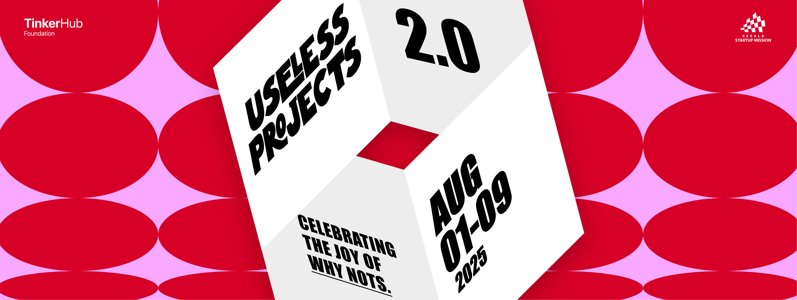

# Scold Me Amma 🎯

## Basic Details
### Team Name: Team കഞ്ഞിയും പയറും


### Team Members
- Team Lead: Caine Benoy - Sahrdaya College of Advanced Studies
- Member 2: Adhityan Vembanat - Sahrdaya College of Advanced Studies
### Project Description
"Scold Me Amma" is a fun, nostalgic web application that allows users to generate and listen to typical scoldings from a South Indian Malayali mother. It combines AI-generated text with text-to-speech technology to bring a humorous touch to everyday parental admonishments.

### The Problem (that doesn't exist)
In a world where children are glued to their screens, constantly procrastinating, and forgetting their responsibilities, how can a busy Malayali mother deliver her timeless wisdom (and scoldings) without having to physically be there? And what if you're an adult, far from home, missing the unique charm of Amma's daily "vazhakku"?

### The Solution (that nobody asked for)
Enter "Scold Me Amma"! A one-stop digital solution for all your scolding needs. Simply click a button, and let our AI-powered Amma deliver a perfectly crafted, authentic Malayali scolding in her own voice. It's the perfect blend of nostalgia, humor, and a gentle reminder to get things done – all without the actual guilt trip!

## Technical Details
### Technologies/Components Used
For Software:
- Languages used: TypeScript, JavaScript, HTML
- Frameworks used: Next.js (App Router), React
- Libraries used: Tailwind CSS, `sarvamai` (Sarvam AI Client Library)
- APIs used: Google Gemini API (for text generation and translation), Sarvam AI Text-to-Speech API
- Tools used: Vercel (for deployment)

For Hardware:
- Not applicable for this software-only project.

### Implementation
For Software:
# Installation
To set up the project locally, clone the repository and install the dependencies:

```bash
git clone [your-repo-link]
cd amma-digital-scoldings
npm install # or yarn install
```

# Environment Variables
Create a `.env.local` file in the root of your project and add your API keys:

```
GEMINI_API_KEY="YOUR_GEMINI_API_KEY"
SARVAM_API_SUBSCRIPTION_KEY="YOUR_SARVAM_API_KEY"
```

# Run
To run the development server:

```bash
npm run dev # or yarn dev
```

Open [http://localhost:3000](http://localhost:3000) in your browser to see the result.

### Project Documentation
For Software:

# Screenshots (Add at least 3)


For Hardware:
- Not applicable for this software-only project.

### Project Demo
# Video
[Add your demo video link here]
*A short video demonstrating the process of generating a scolding and playing its audio.*


## Team Contributions
- **v0 AI**: Developed the core Next.js application structure, integrated Gemini API for text generation and translation, and integrated Sarvam AI for text-to-speech.
- **Caine Benoy**: Did most of the coding.
- **Adhityan Vembanat**: He created the Idea and helped with UI.

---
Made with ❤️ at TinkerHub Useless Projects 


